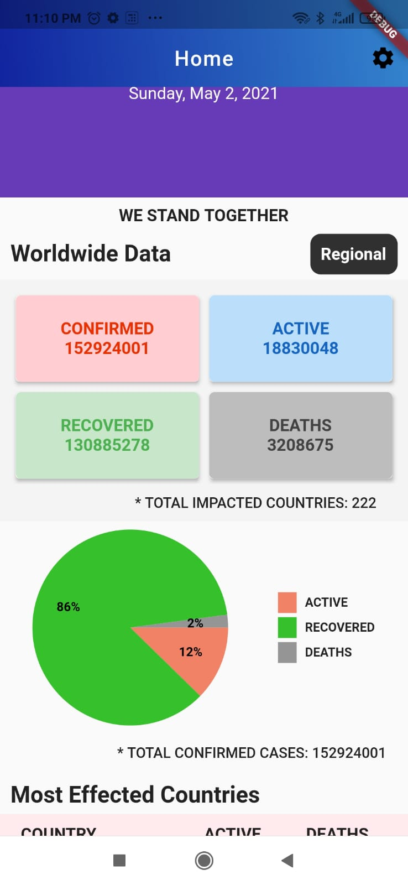

# Flutter Application APK list

## COVID19-Basic App
- This is a basic app that fetches data from API and displays in the UI.
- The data is divided with respect to countries
- Links to external sites for more information
#### Screenshots

## COVID19-Localization App
[Repository Link](https://github.com/kronosking007/Covid-19-Tracker-World-Data-)
- This is a Covid app that fetches data from API and displays in the UI.
- The data is divided with respect to countries and has a quick search feature
- Links to external sites for more information
- Localization Added. Can change to different languages from settings
#### Screenshots
  

## Flutter-GoogleSheetsApi App
[Repository Link](https://github.com/kronosking007/Flutter-GoolgeSheetsAPI)
- This flutter app fetched from a custom API which is hosted using google sheets
- Any changes made to data on the sheets is reflected on the app with quick refresh
#### Screenshots

## Portfolio App
[Repository Link](https://github.com/kronosking007/Portfolio-wapp)
- This is My official Portfolio App
- Congtains links to all my social and developer accouts
- External links to my works repositories on github and published applicaiotns
- direct contact with accessing native mail feature
#### Screenshots
 

## OurWall App
[Repository Link](https://github.com/kronosking007/OurWall-Academic-Project)
- This is a family connectivity application built as a part of academic project
- Database has been deleted by accident hence unable to login to the app
- However the code provides good reference to the app and there is a detailed documentation report.
#### Screenshots

## Svago-Stickers App
[Repository Link](https://github.com/kronosking007/svago-template)
- This is a whatsapp stickers app for android 
- App uses locan assets and JSON file to link and display assets
- Integrated with Firebase ads and project can be expanded using a custiom API
#### Screenshots
  

